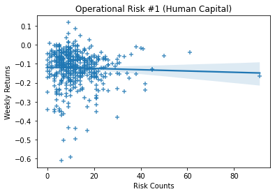
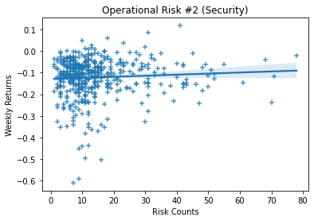
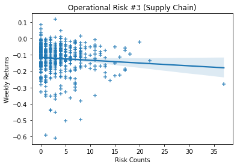
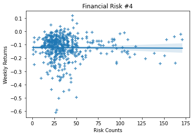
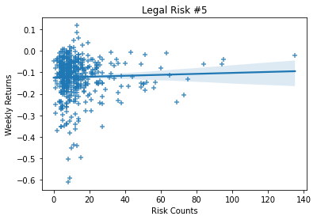
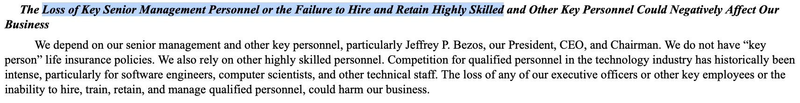
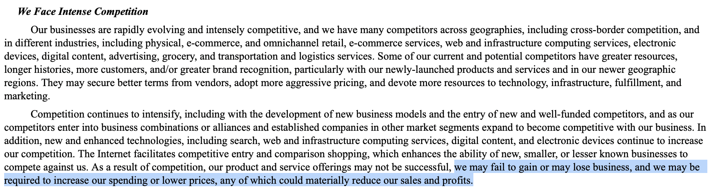

### 1. Loading the Data


```python
import pandas as pd
import numpy as np
import seaborn as sns
import matplotlib.pyplot as plt 
```


```python
sp500_updated = pd.read_csv('output/sp500_accting_plus_textrisks.csv')
stock_prices = pd.read_stata('data/2019-2020-stock_rets cleaned.dta').rename(columns = {'ticker':'Symbol'})
```

### 2. Computing Stock Returns


```python
stock_prices_mar = stock_prices[stock_prices['date'].between(20200309,20200313)]
```


```python
daily_ret = stock_prices_mar['ret']
daily_ret = pd.to_numeric(daily_ret)
```


```python
weekly_ret = (stock_prices_mar
              .assign(weekly_ret = 1 + daily_ret)
              .groupby(['Symbol'])
              ['weekly_ret'].prod()
              -1
             ).reset_index()
```


```python
sp500_final = sp500_updated.merge(weekly_ret, how='left', left_on='Symbol', right_on = 'Symbol', indicator='exists', validate='1:1')
```

### 3. Visualizations

#### Operational Risk #1 (Human Capital)

The relationship between Weekly Returns and Risk Counts is mildly negative. While the negative slope is not strong at all, the greater number of risks related to human capital leads to slightly weaker stock returns. 


```python
ax = sns.regplot(data = sp500_final, x = 'Operational_Risk1', y = 'weekly_ret', marker = "+")
ax.set(title = 'Operational Risk #1 (Human Capital)', ylabel = 'Weekly Returns', xlabel = 'Risk Counts')

plt.show()
```


    

    


#### Operational Risk #2 (Security)

The relationship between Weekly Returns and Risk Counts is positive, meaning the higher the risk counts, the greater the weekly returns. However, as noted, the positive relationship is not particularly strong. 


```python
ax = sns.regplot(data = sp500_final, x = 'Operational_Risk2', y = 'weekly_ret', marker = "+")
ax.set(title = 'Operational Risk #2 (Security)', ylabel = 'Weekly Returns', xlabel = 'Risk Counts')

plt.show()
```


    

    


#### Operational Risk #3 (Supply Chain)

The relationship between Weekly Returns and Risk Counts is negative when it comes to supply chain risks.


```python
ax = sns.regplot(data = sp500_final, x = 'Operational_Risk3', y = 'weekly_ret', marker = "+")
ax.set(title = 'Operational Risk #3 (Supply Chain)', ylabel = 'Weekly Returns', xlabel = 'Risk Counts')

plt.show()
```


    

    


#### Financial Risk #4

The relationship between Weekly Returns and Financial Risk Counts is almost flat, suggesting the number of financial risk counts does not necessarily affect returns. 


```python
ax = sns.regplot(data = sp500_final, x = 'Financial_Risk4', y = 'weekly_ret', marker = "+")
ax.set(title = 'Financial Risk #4', ylabel = 'Weekly Returns', xlabel = 'Risk Counts')

plt.show()
```


    

    


#### Legal Risk #5

There is a positive relationship between Weekly Returns and Risk Counts, meaning the higher the risk counts leads to slight increase in weekly returns. 


```python
ax = sns.regplot(data = sp500_final, x = 'Legal_Risk5', y = 'weekly_ret', marker = "+")
ax.set(title = 'Legal Risk #5', ylabel = 'Weekly Returns', xlabel = 'Risk Counts')

plt.show()
```


    

    


### 4. Risk Measurements

#### Mechanical and Economic Reasoning

For this assignment, I looked at 3 different categories of risks - Operational, Financial and Legal. The Operational Risk category had three variations  - Human Capital, Security and Supply Chain. I started this assignment by reviewing a sample of 10-Ks to determine the most commonly discussed Risk Factors. All of the sampled 10-Ks had mentioned these three types of risks, though there were some differences in how they defined or included in each Risk Factor. Particularly, Operational Risk seemed to have the largest variations, covering many different parts of operations depending on the type of company and its business model. Therefore, I looked into 3 different variations of Operational Risk. 

1. **Operational Risks** - (A) Human Capital, (B) Security, (C) Supply Chain

Operational risks measure 2 diffrent variations of risks that threaten the sustainable operational capabilities of companies. I wanted to choose risks that not only affect the day-to-day activities, but also the overall, long-term goals and growth. Human cappital came to mind especially for the top companies of SP500. Many companies still have influence of the founders or have well-known C-suite executives. Also, with the Great Resignation (though I know the period is before this, I wanted to note this because existing human capital issues would probably only have been exacerbated at the onset of COVID). Security was the second I chose given the recent incidents of serious various cybersecurity breaches. Lastly, supply chain was the third operational risks given the recent shortage of supplies during COVID. 

```python
Operational_Risk1 = ['(employee|management|personnel|labor)',
         '(loss|failure|retain|hire|skilled|shortage)']

Operational_Risk2 = ['(cybersecurity|data|security)', 
         '(quality|loss|outage|breach|risk)']

Operational_Risk3 = ['(supply|chain|supplies|supplier)',
         '(shortage|limited|risk|quality)']
```

2. **Financial Risks**

For financial risks, I wanted to particularly assess how competitors affected the profits and revenue growth. 

```python
Financial_Risk4 = ['(profit|revenue|growth|financial)',
         '(decline|lost|competition|competitive|risk)']
```

3. **Legal Risks**

For legal risks, instead of focusing on one single aspect, I wanted to keep broad and include all of regulatory, compliance and litigation. 

```python
Legal_Risk5 = ['(legal|regulatory|compliance|litigation)',
         '(risk|dispute|breach|claim|lawsuit)']
```

#### Statistical Properties

Financial Risk has the largest counts (mean), while Operational Risk 3 (Supply Chain) had the least. 


```python
sp500_risks = sp500_final[['Operational_Risk1', 'Operational_Risk2', 'Operational_Risk3', 'Financial_Risk4', 'Legal_Risk5']]
sp500_risks.describe()
```


<div>
<style scoped>
    .dataframe tbody tr th:only-of-type {
        vertical-align: middle;
    }

    .dataframe tbody tr th {
        vertical-align: top;
    }

    .dataframe thead th {
        text-align: right;
    }
</style>
<table border="1" class="dataframe">
  <thead>
    <tr style="text-align: right;">
      <th></th>
      <th>Operational_Risk1</th>
      <th>Operational_Risk2</th>
      <th>Operational_Risk3</th>
      <th>Financial_Risk4</th>
      <th>Legal_Risk5</th>
    </tr>
  </thead>
  <tbody>
    <tr>
      <th>count</th>
      <td>492.000000</td>
      <td>492.000000</td>
      <td>492.000000</td>
      <td>492.000000</td>
      <td>492.000000</td>
    </tr>
    <tr>
      <th>mean</th>
      <td>12.380081</td>
      <td>14.298780</td>
      <td>3.652439</td>
      <td>37.414634</td>
      <td>13.136179</td>
    </tr>
    <tr>
      <th>std</th>
      <td>9.095771</td>
      <td>11.853921</td>
      <td>4.171372</td>
      <td>25.586378</td>
      <td>13.983543</td>
    </tr>
    <tr>
      <th>min</th>
      <td>0.000000</td>
      <td>1.000000</td>
      <td>0.000000</td>
      <td>1.000000</td>
      <td>0.000000</td>
    </tr>
    <tr>
      <th>25%</th>
      <td>6.000000</td>
      <td>7.000000</td>
      <td>1.000000</td>
      <td>23.000000</td>
      <td>6.000000</td>
    </tr>
    <tr>
      <th>50%</th>
      <td>10.000000</td>
      <td>11.000000</td>
      <td>3.000000</td>
      <td>31.000000</td>
      <td>9.000000</td>
    </tr>
    <tr>
      <th>75%</th>
      <td>16.000000</td>
      <td>17.000000</td>
      <td>5.000000</td>
      <td>42.000000</td>
      <td>14.000000</td>
    </tr>
    <tr>
      <th>max</th>
      <td>91.000000</td>
      <td>78.000000</td>
      <td>37.000000</td>
      <td>171.000000</td>
      <td>135.000000</td>
    </tr>
  </tbody>
</table>
</div>


### 5. Validation Checks

The pictures below includes the risk terms. 


```python
from IPython.display import Image

img1 = 'data/validation-1.png'
Image(filename=img1)
```


    

    


```python
img2 = 'data/validation-2.png'
Image(filename=img2)
```


    

    


### 6. Describing the Final Sample


```python
sp500_final.describe()
```


<div>
<style scoped>
    .dataframe tbody tr th:only-of-type {
        vertical-align: middle;
    }

    .dataframe tbody tr th {
        vertical-align: top;
    }

    .dataframe thead th {
        text-align: right;
    }
</style>
<table border="1" class="dataframe">
  <thead>
    <tr style="text-align: right;">
      <th></th>
      <th>Unnamed: 0</th>
      <th>CIK</th>
      <th>Operational_Risk1</th>
      <th>Operational_Risk2</th>
      <th>Operational_Risk3</th>
      <th>Financial_Risk4</th>
      <th>Legal_Risk5</th>
      <th>gvkey</th>
      <th>lpermno</th>
      <th>fyear</th>
      <th>...</th>
      <th>prof_a</th>
      <th>ppe_a</th>
      <th>cash_a</th>
      <th>xrd_a</th>
      <th>dltt_a</th>
      <th>invopps_FG09</th>
      <th>sales_g</th>
      <th>dv_a</th>
      <th>short_debt</th>
      <th>weekly_ret</th>
    </tr>
  </thead>
  <tbody>
    <tr>
      <th>count</th>
      <td>505.000000</td>
      <td>5.050000e+02</td>
      <td>492.000000</td>
      <td>492.000000</td>
      <td>492.000000</td>
      <td>492.000000</td>
      <td>492.000000</td>
      <td>355.000000</td>
      <td>355.000000</td>
      <td>355.000000</td>
      <td>...</td>
      <td>355.000000</td>
      <td>355.000000</td>
      <td>355.000000</td>
      <td>355.000000</td>
      <td>355.000000</td>
      <td>334.000000</td>
      <td>0.0</td>
      <td>355.000000</td>
      <td>349.000000</td>
      <td>490.000000</td>
    </tr>
    <tr>
      <th>mean</th>
      <td>252.000000</td>
      <td>7.887301e+05</td>
      <td>12.380081</td>
      <td>14.298780</td>
      <td>3.652439</td>
      <td>37.414634</td>
      <td>13.136179</td>
      <td>45305.952113</td>
      <td>53570.729577</td>
      <td>2018.884507</td>
      <td>...</td>
      <td>0.151314</td>
      <td>0.247454</td>
      <td>0.126002</td>
      <td>0.031169</td>
      <td>0.296568</td>
      <td>2.698513</td>
      <td>NaN</td>
      <td>0.025464</td>
      <td>0.112481</td>
      <td>-0.121810</td>
    </tr>
    <tr>
      <th>std</th>
      <td>145.925209</td>
      <td>5.501050e+05</td>
      <td>9.095771</td>
      <td>11.853921</td>
      <td>4.171372</td>
      <td>25.586378</td>
      <td>13.983543</td>
      <td>61170.060945</td>
      <td>30143.136238</td>
      <td>0.320067</td>
      <td>...</td>
      <td>0.074428</td>
      <td>0.218987</td>
      <td>0.138469</td>
      <td>0.050173</td>
      <td>0.181230</td>
      <td>2.107435</td>
      <td>NaN</td>
      <td>0.026991</td>
      <td>0.111168</td>
      <td>0.090491</td>
    </tr>
    <tr>
      <th>min</th>
      <td>0.000000</td>
      <td>1.800000e+03</td>
      <td>0.000000</td>
      <td>1.000000</td>
      <td>0.000000</td>
      <td>1.000000</td>
      <td>0.000000</td>
      <td>1045.000000</td>
      <td>10104.000000</td>
      <td>2018.000000</td>
      <td>...</td>
      <td>-0.323828</td>
      <td>0.009521</td>
      <td>0.002073</td>
      <td>0.000000</td>
      <td>0.000000</td>
      <td>0.405435</td>
      <td>NaN</td>
      <td>0.000000</td>
      <td>0.000000</td>
      <td>-0.610145</td>
    </tr>
    <tr>
      <th>25%</th>
      <td>126.000000</td>
      <td>9.747600e+04</td>
      <td>6.000000</td>
      <td>7.000000</td>
      <td>1.000000</td>
      <td>23.000000</td>
      <td>6.000000</td>
      <td>6286.000000</td>
      <td>19531.500000</td>
      <td>2019.000000</td>
      <td>...</td>
      <td>0.102413</td>
      <td>0.091581</td>
      <td>0.031900</td>
      <td>0.000000</td>
      <td>0.177941</td>
      <td>1.234730</td>
      <td>NaN</td>
      <td>0.000000</td>
      <td>0.028043</td>
      <td>-0.159331</td>
    </tr>
    <tr>
      <th>50%</th>
      <td>252.000000</td>
      <td>8.820950e+05</td>
      <td>10.000000</td>
      <td>11.000000</td>
      <td>3.000000</td>
      <td>31.000000</td>
      <td>9.000000</td>
      <td>13700.000000</td>
      <td>58683.000000</td>
      <td>2019.000000</td>
      <td>...</td>
      <td>0.138699</td>
      <td>0.162561</td>
      <td>0.072171</td>
      <td>0.009526</td>
      <td>0.285137</td>
      <td>2.155533</td>
      <td>NaN</td>
      <td>0.020454</td>
      <td>0.084992</td>
      <td>-0.106716</td>
    </tr>
    <tr>
      <th>75%</th>
      <td>378.000000</td>
      <td>1.137789e+06</td>
      <td>16.000000</td>
      <td>17.000000</td>
      <td>5.000000</td>
      <td>42.000000</td>
      <td>14.000000</td>
      <td>61582.500000</td>
      <td>82620.000000</td>
      <td>2019.000000</td>
      <td>...</td>
      <td>0.186883</td>
      <td>0.336729</td>
      <td>0.166690</td>
      <td>0.042936</td>
      <td>0.390672</td>
      <td>3.301717</td>
      <td>NaN</td>
      <td>0.037617</td>
      <td>0.151231</td>
      <td>-0.064739</td>
    </tr>
    <tr>
      <th>max</th>
      <td>504.000000</td>
      <td>1.868275e+06</td>
      <td>91.000000</td>
      <td>78.000000</td>
      <td>37.000000</td>
      <td>171.000000</td>
      <td>135.000000</td>
      <td>316056.000000</td>
      <td>93436.000000</td>
      <td>2019.000000</td>
      <td>...</td>
      <td>0.390384</td>
      <td>0.928562</td>
      <td>0.694612</td>
      <td>0.336795</td>
      <td>1.071959</td>
      <td>12.164233</td>
      <td>NaN</td>
      <td>0.138594</td>
      <td>0.761029</td>
      <td>0.117748</td>
    </tr>
  </tbody>
</table>
<p>8 rows × 45 columns</p>
</div>


